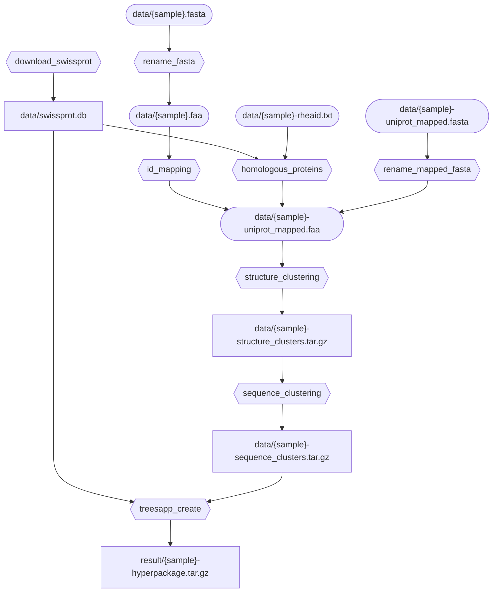

# Installation:

1. Clone repository/download workflow code
2. Create conda environment with `conda env create -f environment.yaml`
3. Activate environment with `conda activate snakemake_env`

Update conda environment with `conda env update --file environment.yaml`

# Usage:

1. Place a `.fasta` or `.faa` file in `data/`, ex. `data/DsrAB.faa`
2. Request a finished file with `snakemake --use-conda result/DsrAB-hyperpackage.tar.gz`

There are other inputs that you can give, and you can also request intermediate files.

# Flowchart (slightly out of date):



# Tests

## Creating a test

Scenario-based tests are generated in

- `tests/successful_scenarios/`
- `tests/failing_scenarios/`

Each scenario should contain the directories `intial_state/` and `final_state/`. Snakemake will work in directory with
the `workflow/` directory, as well as the top level `utils/` and `config/` directories if they are not specified in the
scenario (`.example` files in the global `config/` directory will be renamed). The test will run snakemake requesting
all the files in `final_state/`. `final_state/` does not need to include the files that are in `initial_state`. For
`tests/successful_scenarios/` snakemake must exit normally, and the contents of the `final_state/` directory will be
checked for and compared for accuracy. For `tests/failing_scenarios/` snakemake must *not* exit normally. The files in
`final_state` will be requested, but not tested against.

Let's make a test for the following rule:

```snakemake
rule rhea_homologous_proteins:
    input:
        "input/{sample}-rhea_id.txt",
        "utils/swissprot_data.tsv.gz",
        "utils/swissprot_sequences.fasta.gz"
    output:
        "data/{sample}-uniprot_mapped.faa"
    script:
        "scripts/rhea_homologous_proteins.py"
```

We can make the inputs:

```
tests/successful_scenarios/rhea_test/initial_state/
|-- input/
|   |-- whatever-rhea_id.txt
```

and the outputs:

```
tests/successful_scenarios/rhea_test/final_state/
|-- data/
|   |-- whatever-uniprot_mapped.faa
```

If `config` and `util` directories are not provided, they will be linked from the main
directory. If your rule depends on a config value, it is best to include a config in your scenario so that it runs as
expected every time.

## Running tests

You can run all tests with `pytest`, or with multiple cores `pytest -n auto`. Things can get funky with the multi-core
tests if you have a situation like you have not already downloaded something in `utils/` and now several tasks are going
to try to do it at once.
