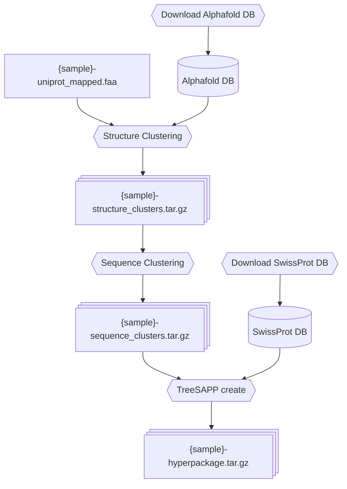
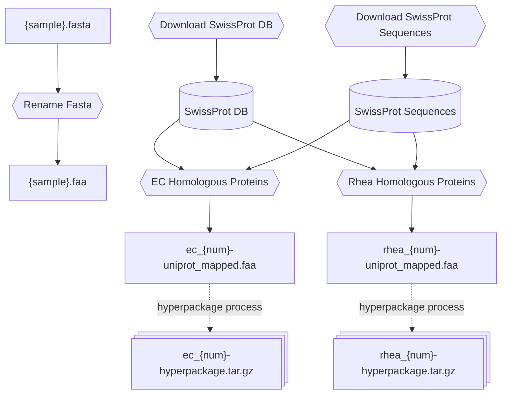

# TreeSAPP Hyperpackage Workflow

This is a [snakemake](https://snakemake.github.io/) workflow project that aims to extend the functionality of
[TreeSAPP](https://github.com/hallamlab/TreeSAPP) to create [reference packages](https://github.com/hallamlab/TreeSAPP/wiki/Building-reference-packages-with-TreeSAPP#step-2-creating-the-reference-package)
(phylogentic trees) based on functional homology via Rhea ID, EC number, or other groupings rather than from manually
curated collections of protein sequences. 

This workflow can:

1. Generate a collection of proteins from a Rhea ID or EC number
2. Cluster a collection of proteins that would not be suitable to create one reference package into several clusters suitable for creating reference packages, first by structural similarity then sequence similarity
3. Create a "hyperpackage" (collection of TreeSAPP reference packages) from clustered proteins

In the future this workflow should:

1. Support querying a hyperpackage via structural data

# Installation:

This workflow requires [Anaconda/Miniconda](https://www.anaconda.com/docs/getting-started/miniconda/install). 

1. Clone repository/download workflow code
2. Create conda environment with `conda env create -f environment.yaml`
3. Activate environment with `conda activate snakemake_env`

After updating the project, update potential dependency changes with `conda env update --file environment.yaml`.

# Usage:

With snakemake you request a file(s), and the workflow will attempt to use available files and run steps to create that
file(s). A typical example in this project would be `snakemake --use-conda result/ec_3.4.1.2-hyperpackage.tar.gz` to create a
hyperpackage from the EC number 3.4.1.2. The `--use-conda` flag is required in this workflow for intermediate tools to
work.

## Hyperpackage create process

The following flowchart describes the workflow. If you run the workflow requesting a file like `snakemake --use-conda result/test-hyperpackage.tar.gz`,
snakemake will try to produce it using the `TreeSAPP create` step, and check if the file `test-sequence_clusters.tar.gz`
exists, and if not create it using the `Sequence Clustering` step and so on. You can request or provide a file from any
point in the process, and snakemake will attempt to reuse existing intermediate files. 

## User inputs

The following flowchart describes ways users might interact with the workflow. A `.faa` file with functionally
homologous proteins can be generated with either a Rhea activity ID or EC number. These values can be passed by
requesting something like `snakemake --use-conda result/ec_1.1.1.1-hyperpackage.tar.gz`, which will eventually request a
`data/ec_1.1.1.1-uinprot_mapped.faa` file. Rhea IDs are supported in the format `rhea_XXXXX`, and EC numbers in the format
`ec_X.X.X.X`, with more general forms like `ec_X.X` also being valid. There is a config option for capping the number of
homologous proteins gathered. 

A user can also directly provide sequences in `data/{sample}.faa`. These sequences must either already have Uniprot
accession IDs, or use another ID in a standard format that can be mapped to Uniprot. *This currently does not work, check*
[#19](https://github.com/RyloByte/TS-Capstone-2025/issues/19).

If at any point the workflow needs a `.fasta` file to be renamed to a `.faa` file it will copy the file with a `.faa`
extension and then delete it at the end of the workflow if it was an intermediate file. 

# Hyperpackages

### TODO - need more info here

A hyperpackage is a collection of TreeSAPP reference packages. 

# Tests

## Running

The tests for this project can be run via `pytest`. They can be run in parallel to save time by `pytest -n auto`,
however if you have not previously run steps to download things like SwissProt data and sequences, you may have
multiple tests attempt to download them at the same time which may not work.

## Creating a test

This project primarily uses a scenario based testing framework. This means that each test will be automatically generated from an
`initial_state/` and a `final_state/` in `scenarios_dir/scenario/`. Tests for successful workflow runs are located in
`tests/successful_scenarios/`. Tests for expected failed scenarios are found in `tests/failing_scenarios/`.

A scenario test runs by:

1. Running the test in an isolated environment
2. Copying the contents of `intial_state/` to the isolated environment
3. Linking the contents of `workflow/` and `utils/` to the isolated environment
4. If no `config/` directory is provided in the `initial_state/`, copy the items from the top level `config/` directory that end with `.example` (use the default config values)
5. Run snakemake, requesting every file in the `final_state/` directory
6. Verify that snakemake exited normally (verify that it did not exit normally for failure tests)
7. (Successful scenarios only) Go through each file in `final_state/`, check that it has been created by the workflow, and compare the contents in a platform independent way
