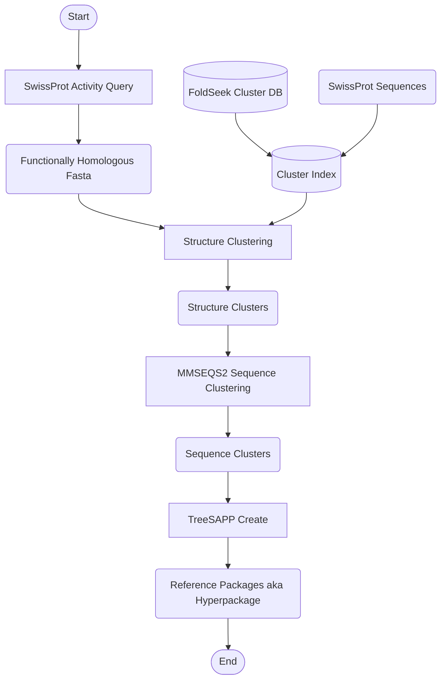

# TreeSAPP Functional Packages Extension

This is a [snakemake](https://snakemake.github.io/) workflow project that extends the functionality of
[TreeSAPP](https://github.com/hallamlab/TreeSAPP) to create composite [reference packages](https://github.com/hallamlab/TreeSAPP/wiki/Building-reference-packages-with-TreeSAPP#step-2-creating-the-reference-package)
(phylogentic trees + other tools) based on functional homology via Rhea ID, EC number, or other groupings rather than from manually
curated collections of protein sequences.

The motivation for this is to create phylogenetic trees centered around some functionality **TODO ADD MORE**

## Workflow Overview



A "hyperpackage" is an archive of several regular TreeSAPP reference packages, each generated from a separate cluster of sequences. **TODO ADD MORE ABOUT THE USAGE OF HYPERPACKAGES**

# Setup

This workflow requires [Conda](https://www.anaconda.com/docs/getting-started/miniconda/install).

1. Clone the repository
2. Create the conda environment via `conda env create -f environment.yaml`
3. Copy the config file `config.yaml.example` to `config.yaml`

**NOTE:** Due to the [conda TreeSAPP dependency](https://anaconda.org/bioconda/treesapp), this workflow currently cannot run natively on ARM (M1/2/etc.) based Macs.

# Usage

## Create Hyperpackage by Activity Number Lookup

Since this project is snakemake based, run snakemake with the files you would like to create. This workflow will create
hyperpackages in the format `data/hyperpackages/<ec|rhea>_<activity number>.refpkg.tar.gz`. If you want to create a
hyperpackage for EC activity number 2.7.10.1, run the following command:

```shell
conda activate snakemake_env
snakemake --use-conda data/hyperpackages/ec_2.7.10.1.refpgk.tar.gz
```

You can similarly create a Rhea ID hyperpackage like:

```shell
snakemake --use-conda data/hyperpackage/rhea_10596.refpkg.tar.gz
```

General EC numbers like `2.7.10` or `2.7` etc. are also supported.

## Create by Other Sequences

You can also create a hyperpackage from any set of SwissProt sequences, not just a group based on functional activity number!
To do so use the [UniProtKB search tool](https://www.uniprot.org/), select `Reviewed (Swiss-Prot)` in the top left under
`Status`, and then click `Download(...)`, and select format `FASTA (canonical)` (compressed or uncompressed is fine). Put
the `.fasta` or `.fasta.gz` in `data/` and then request the resulting files. Ex. download `my_seqs.fasta`, move it to
`data/my_seqs.fasta`, and make a hyperpackage by:

```shell
snakemake --use-conda data/hyperpackages/my_seqs.refpkg.tar.gz
```

## Logistics

The `--use-conda` flag is required for the underlying tools to work.

You can also request any intermediate file such as:

```shell
snakemake --use-conda data/structure_clusters/rhea_10596.tar.gz
```

The first time you run the workflow some extra time may be taken to initially build files, but subsequent runs should
only take a few minutes for average to smaller groups of sequences.

This program creates files in:

```
utils/                     <-- utility files for building clusters etc.
data/                      <-- SwissProt .fasta files of functionally homologous proteins
data/structure_clusters/   <-- .tar.gz archives of .fasta files broken up by structure cluster
data/sequence_clusters/    <-- .tar.gz archives of .fasta files broken up by sequence cluster
data/hyperpackages/        <-- .tar.gz archives of reference packages made from clusters
```

# Configuration

Inside the `config.yaml` file you will find options that can alter the behavior and results of the workflow with descriptions.
Among these are extra arguments to pass to `mmseqs2 easy-linclust` and `treesapp create`.
