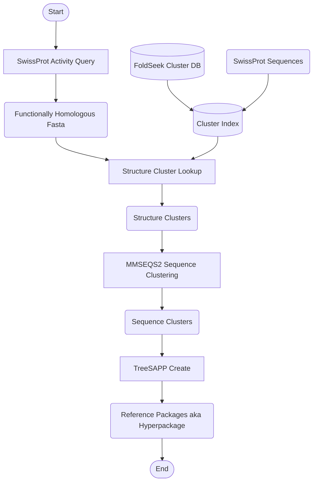
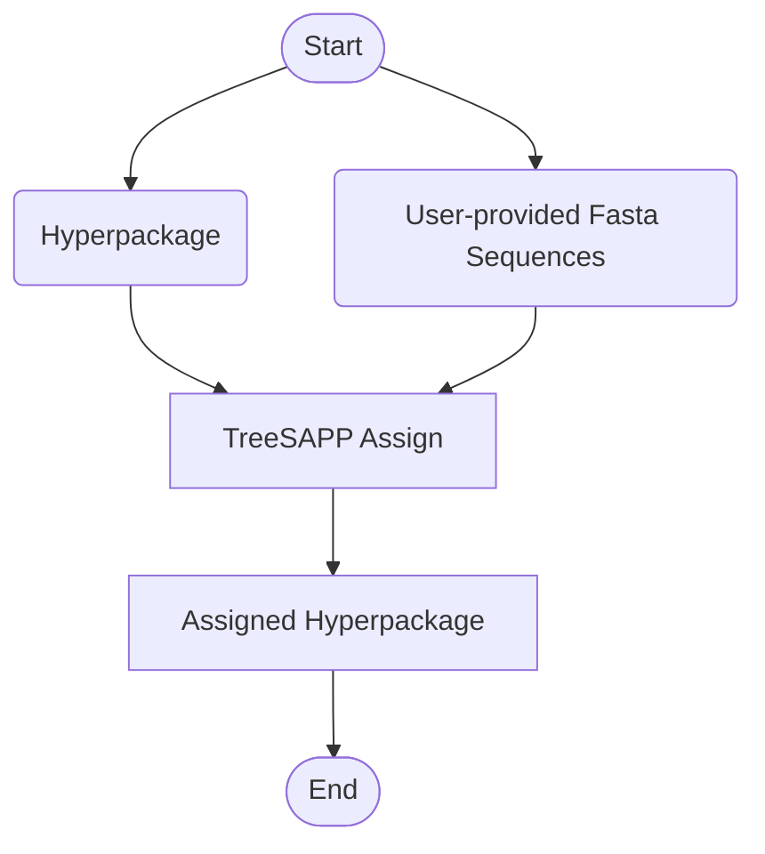

# TreeSAPP Functional Packages Extension

This is a [snakemake](https://snakemake.github.io/) workflow project that extends the functionality of
[TreeSAPP](https://github.com/hallamlab/TreeSAPP) to create composite [reference packages](https://github.com/hallamlab/TreeSAPP/wiki/Building-reference-packages-with-TreeSAPP#step-2-creating-the-reference-package)
(phylogentic trees + other tools) based on functional homology via Rhea ID, EC number. The starting sequences can be
from any grouping, but this tool automates based off of Rhea and EC activity numbers. 

The motivation for this is to create and use phylogenetic trees that are based on a some characteristic (such as function)
rather than a manually curated collection with high sequence identity etc. The given sequences are clustered and
reference packages are made for each cluster, which are then combined into a "hyperpackage".

## Google Colab Demo

For the purposes of simplicity and accessibility, we created this Google Colab demo to allow users to interact with our tool without any local setup. Colab provides an easy-to-use environment where users can run code, adjust parameters, and retrieve results directly in the browser, making it ideal for showcasing functionality.

[Link to Google Colab UI](https://colab.research.google.com/github/RyloByte/TS-Capstone-2025/blob/%2335_2/notebooks/colab_hyperpackage_creation.ipynb)

## Hyperpackage Create Overview



**NOTE:** The `Functionally Homologous Fasta` can be any set of sequences from SwissProt. This workflow automatically
gets SwissProt fastas based on Rhea or EC activity number, but you can use any SwissProt formatted fasta file you want.

## Hyperpackage Assign Overview


**NOTE:** Fasta sequences must be provided by the user. For more detail, view the Hyperpackage Assign section below.

# Usage

### Supported Platforms

This tool is limited to x64 linux and MacOS. Running on ARM via. Apple Rosetta or Docker VMM has been unsuccessful.

## Setup

### Conda

```shell
# Clone the repository
git clone https://github.com/RyloByte/TS-Capstone-2025.git
cd TS-Capstone-2025

# Create the conda environment
conda env create -f environment.yaml

# Copy the example config file
cp config.yaml.example config.yaml

# Activate the conda environment
conda activate snakemake_env

# Use the tool, need use-conda flag for underlying tools
snakemake --use-conda ...
```

### Docker

Download the `run.sh` script from the repository and use the tool as `./run.sh ...`.

The run script will check for `config.yaml` and if it is not present use default values.

## Configuration

Inside the `config.yaml` file you will find options that can alter the behavior and results of the workflow with descriptions.
Among these are extra arguments to pass to `mmseqs2 easy-linclust` and `treesapp create`.

## Create Hyperpackage by Activity Number Lookup

This tool is snakemake based. You run it by requesting the desired files. Hyperpackages go in `results/hyperpackages/<>.refpkg.tar.gz`.
This tool will automatically look up sequences by Rhea ID (`rhea_<number>`) or EC number (`ec_<number>`).
To request a hyperpackage from EC number 2.7.10.1 run:

```shell
# for conda
snakemake --use-conda results/hyperpackages/ec_2.7.10.1.refpkg.tar.gz

# for docker
./run.sh results/hyperpackages/ec_2.7.10.1.refpkg.tar.gz
```

The tool will automatically run necessary intermediate steps like initializing the cluster database, downloading the
needed fasta files, etc.

## Create by Other Sequences

You can also create a hyperpackage from any set of SwissProt sequences, not just a group based on functional activity number!
To do so use the [UniProtKB search tool](https://www.uniprot.org/), select `Reviewed (Swiss-Prot)` in the top left under
`Status`, and then click `Download(...)`, and select format `FASTA (canonical)` (compressed or uncompressed is fine). Put
the `.fasta` or `.fasta.gz` in `data/` and then request the resulting files. Ex. download `my_seqs.fasta`, move it to
`data/my_seqs.fasta`, and make a hyperpackage by:

```shell
snakemake --use-conda results/hyperpackages/my_seqs.refpkg.tar.gz
```

## Hyperpackage Assign

When using hyperpackage assign, the workflow will go through each reference package within a hyperpackage and assign a user-provided fasta file using TreeSAPP's assign function.

To use hyperpackage assign, first place your input FASTA file in the `data/` directory and name it as `{fasta_name}.fasta`. No other action is needed for any hyperpackage created from this workflow in the same session. If you have already generated your own hyperpackage, place this file within the `results/hyperpackages/` directory. The tool will process your sequences and generate assigned hyperpackages based on structural and functional similarity.

Once the a fasta file and a hyperpackage are in their appropriate directory location, run one of the commands below.
```shell
# for conda
snakemake --use-conda results/assigned_hyperpackages/{fasta_name}/{sample_id}.refpkg.tar.gz

# for docker
./run.sh results/assigned_hyperpackages/{fasta_name}/{sample_id}.refpkg.tar.gz
```
Replace `{fasta_name}` with the name of your input file (without the .fasta extension), and `{sample_id}` with the identifier for your sample.

After the assignment is complete, you can access your results at `results/assigned_hyperpackages/{fasta_name}/{sample_id}.refpkg.tar.gz`

# File Layout

You can also request any intermediate file such as:

```shell
snakemake --use-conda data/structure_clusters/rhea_10596.tar.gz
```

The first time you run the workflow some extra time may be taken to initially build files, but subsequent runs should
only take a few minutes for average to smaller groups of sequences.

This program creates files in:

```
utils/                            <-- utility files for building clusters etc.
data/                             <-- SwissProt .fasta files
data/structure_clusters/          <-- .tar.gz archives of .fasta files broken up by structure cluster
data/sequence_clusters/           <-- .tar.gz archives of .fasta files broken up by sequence cluster
results/hyperpackages/            <-- .tar.gz archives of reference packages made from clusters
results/assigned_hyperpackages/   <-- .tar.gz archives of reference packages annotated with assignment operation
```