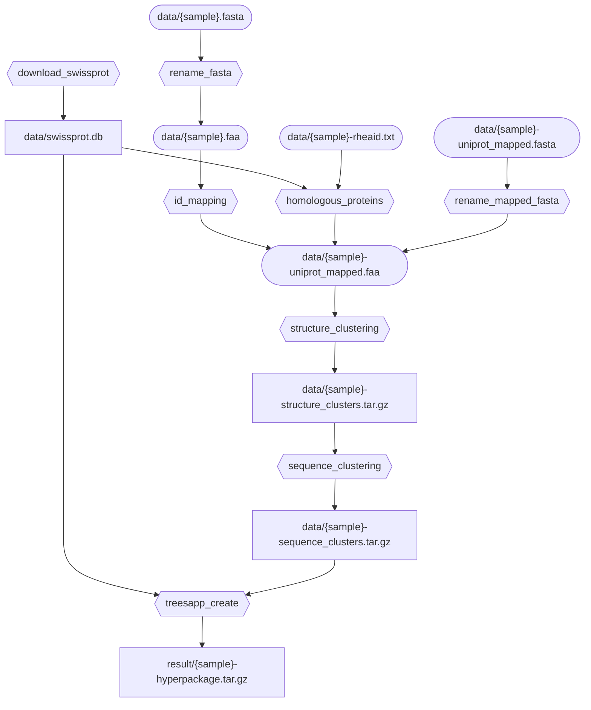

Create environment: `conda env create -f environment.yaml`

Activate environment: `conda activate snakemake_env`

Run workflow for input `data/{sample}.faa` or `data/{sample}.fasta`: `snakemake --use-conda --cores 4 result/{sample}-hyperpackage.tar.gz`

Delete intermediate files: `snakemake --delete-all-output` (might delete your input `data/{sample}.faa` file?)

Installation:

1. Clone repository/download workflow code
2. Create conda environment with `conda env create -f environment.yaml`
3. Activate environment with `conda activate snakemake_env`

Usage:

1. Place a `.fasta` or `.faa` file in `data/`, ex. `data/DsrAB.faa`
2. Request a finished file with `snakemake --use-conda result/DsrAB-hyperpackage.tar.gz`

Flowchart:

